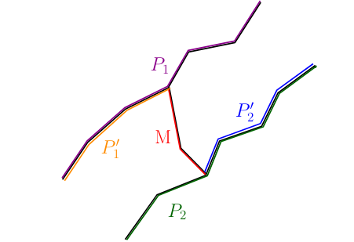

A) Em um grafo desconexo é possível que eu tenha dois caminhos de comprimento máximo com o mesmo valor em partes desconexas do grafo. Por exemplo um grafo que sejam dois quadrados desconexos,
dessa maneira em grafos desconexos a afirmativa não é verdadeira.

B) Um grafo Conexo pode ou não ser Hamiltoniano, no caso do grafo Hamiltoniano como o caminho de comprimento máximo tem de passar em todos os vértices, dois caminhos de comprimento máximo sempre vão ter vértices em comum. Já no caso de um grafo que não seja Hamiltoniano, dois caminhos de maior comprimento sempre vão ter pelo menos um vértice em comum.

Isto pode ser provado, vamos pensar num grafo que tem dois caminhos mais longos, C1 e C2. Vamos assumir que P1 e P2 não tem nenhuma conexão entre si. Como G é um grafo conexo é possível traçar um caminho M que liga P1 e P2 de maneira que um novo caminho inicie em P1 e termine em P2, lembrando que nenhum vertice em M é pertencente a P1 ou P2.

Vamos assumir como vertice x o vertice que dividde P1 em dois caminhos e como vertice y o que divide P2 em dois caminhos. P1' e P2' sendo os maiores desses caminhos. Como M > 1 e P1' e P2' são maiores que metade do caminho de maior comprimento que haviamos anteriormente (P1 e P2), isso se tornaria um novo caminho mais longo. Dessa maneira dois caminhos mais longos em um grafo conexo sempre vão ter ao menos um vertice em comum.
