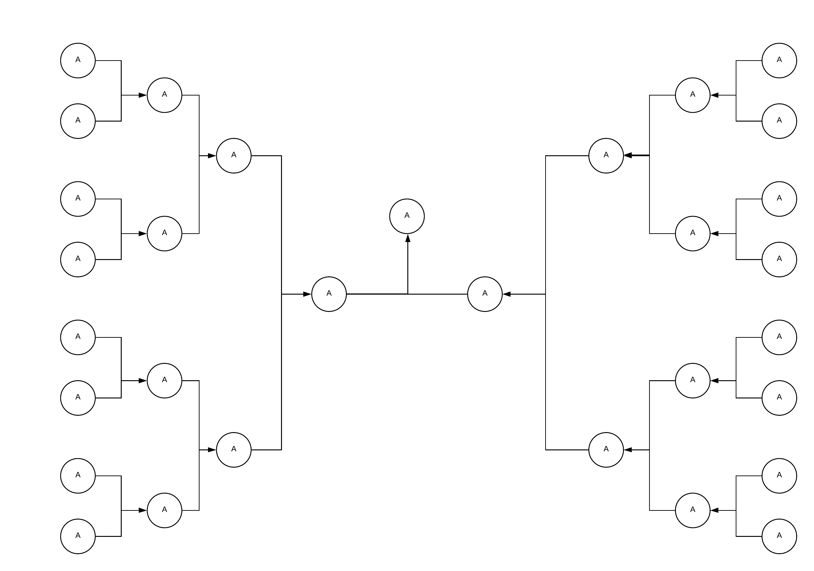
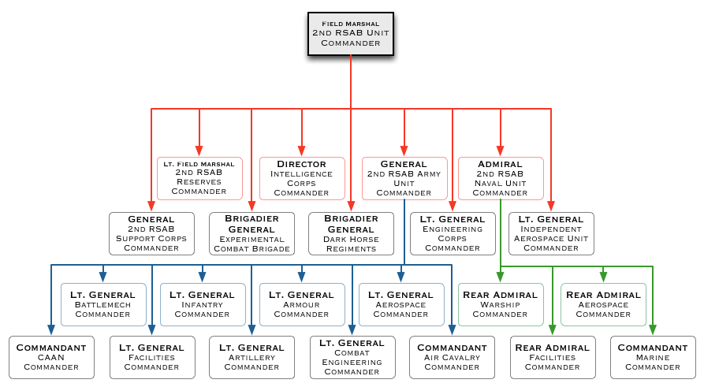

Um digrafo é um grafo dirigido. Ou seja um grafo que suas arestas tem apenas uma direção.

Um torneio de mata-mata pode ser exemplificado por um digrafo, onde cada partida é um vertice.

Outra sistema que tem um formato de um digrafo é uma cadeia de comando militar, onde cada superior é representado por um vertice que aponta para os seus ordenados.

